# How EPUB Pages Are Painted on Screen: A Complete Technical Breakdown

## 🎭 The Theater Analogy

Think of the EPUB page rendering system like a **theater production** with multiple layers of actors, stage managers, and technical crew working together to create the final performance you see on stage.

### The Cast of Characters

- **The Stage (Stage.ts)**: The physical theater stage - creates the main container where everything happens
- **The Stage Manager (DefaultViewManager)**: Coordinates everything, decides which scenes to show, manages transitions
- **The Actors (IframeView)**: Each page is an actor who performs their scene with script and costume
- **The Director (Rendition)**: Overall coordinator who manages the script (EPUB book) and tells everyone what to do
- **The Audience (Browser Rendering Engine)**: The final viewer who sees the painted pixels

## 🔧 The Technical Pipeline

## 📊 Visual Diagrams: Multiple Perspectives

### 1. High-Level Architecture Flow


### 2. Theater Production Pipeline

```mermaid
graph TD
    subgraph "🎭 Theater Setup"
        A[🎪 Stage Manager<br/>DefaultViewManager] --> B[🏗️ Stage Creation<br/>Stage.ts]
        B --> C[📦 Container Element<br/>DOM div]
        C --> D[🎬 Actor Casting<br/>IframeView Creation]
    end

    subgraph "🎨 Actor Preparation"
        E[📝 Script Loading<br/>HTML Content] --> F[👗 Costume Application<br/>CSS Styling]
        F --> G[📍 Stage Positioning<br/>Layout Calculation]
        G --> H[👁️ Visibility Control<br/>Show/Hide]
    end

    subgraph "🎪 Performance"
        I[🎭 Actor Performance<br/>iframe Rendering] --> J[🖥️ Browser Engine<br/>HTML/CSS Parsing]
        J --> K[🎨 Pixel Painting<br/>Screen Output]
    end

    D --> E
    H --> I

    style A fill:#fff3e0
    style E fill:#fce4ec
    style I fill:#e8f5e8
```



### 3. Component Hierarchy

```mermaid
graph TD
    A[📱 ReactReader] --> B[📖 EpubView]
    B --> C[🎭 Rendition]
    C --> D[🎪 DefaultViewManager]
    D --> E[🏗️ Stage]
    D --> F[🎬 Views Collection]
    F --> G[🖼️ IframeView 1]
    F --> H[🖼️ IframeView 2]
    F --> I[🖼️ IframeView N]

    E --> J[📦 Container Div]
    G --> K[🖼️ iframe 1]
    H --> L[🖼️ iframe 2]
    I --> M[🖼️ iframe N]

    style A fill:#e3f2fd
    style C fill:#fff3e0
    style D fill:#f3e5f5
    style G fill:#e8f5e8
```



### 4. Iframe Rendering Process

```mermaid
sequenceDiagram
    participant SM as 🎪 Stage Manager
    participant AV as 🎬 Actor View
    participant IF as 🖼️ iframe
    participant BR as 🌐 Browser Engine
    participant SC as 🖥️ Screen

    SM->>AV: Create IframeView
    AV->>IF: Create iframe element
    AV->>IF: Set srcdoc with HTML
    IF->>BR: Parse HTML content
    BR->>BR: Apply CSS styling
    BR->>BR: Calculate layout
    BR->>SC: Paint pixels
    AV->>IF: Set visibility: visible
    SC->>SC: Display rendered page
```



### 5. Memory and Performance Management

```mermaid
graph TD
    subgraph "🔄 View Lifecycle"
        A[📥 Create View] --> B[📝 Load Content]
        B --> C[👁️ Show View]
        C --> D[🔄 Navigate Away]
        D --> E[👁️ Hide View]
        E --> F[🗑️ Destroy View]
    end

    subgraph "💾 Memory Management"
        G[📊 Active Views<br/>Currently Visible] --> H[💤 Hidden Views<br/>Cached in Memory]
        H --> I[🗑️ Destroyed Views<br/>Freed from Memory]
    end

    C --> G
    E --> H
    F --> I

    style A fill:#e8f5e8
    style F fill:#ffebee
    style G fill:#e3f2fd
```



### 6. DOM Structure Visualization

```mermaid
graph TD
    A[📱 ReactReader Container] --> B[📖 EpubView div]
    B --> C[🎪 epub-container]
    C --> D[🖼️ epub-view 1]
    C --> E[🖼️ epub-view 2]
    C --> F[🖼️ epub-view N]

    D --> G[🖼️ iframe#epubjs-view-1]
    E --> H[🖼️ iframe#epubjs-view-2]
    F --> I[🖼️ iframe#epubjs-view-N]

    G --> J[📄 HTML Content<br/>Chapter 1]
    H --> K[📄 HTML Content<br/>Chapter 2]
    I --> L[📄 HTML Content<br/>Chapter N]

    style A fill:#e3f2fd
    style C fill:#fff3e0
    style G fill:#e8f5e8
    style J fill:#fce4ec
```



### 7. Navigation and Scrolling Flow

```mermaid
graph LR
    subgraph "👆 User Interaction"
        A[👆 Swipe/Click] --> B[⌨️ Keyboard Input]
        B --> C[🖱️ Mouse Scroll]
    end

    subgraph "🎪 Stage Manager Response"
        D[📊 Calculate Position] --> E[🔄 Update Views]
        E --> F[👁️ Show/Hide Views]
        F --> G[📏 Resize iframes]
    end

    subgraph "🖥️ Browser Rendering"
        H[🎨 Repaint Screen] --> I[📱 Update Display]
    end

    A --> D
    C --> D
    G --> H

    style A fill:#e8f5e8
    style D fill:#fff3e0
    style H fill:#e3f2fd
```



### 8. Content Loading Pipeline

```mermaid
flowchart TD
    A[📚 EPUB Archive] --> B[📦 Unzip Files]
    B --> C[📄 Extract XHTML]
    C --> D[🎨 Load CSS Styles]
    D --> E[🖼️ Load Images]
    E --> F[📝 Parse HTML]
    F --> G[🎭 Apply Themes]
    G --> H[🖼️ Inject into iframe]
    H --> I[👁️ Make Visible]

    subgraph "🔄 Parallel Processing"
        J[📄 Text Content] --> K[🎨 Styling]
        L[🖼️ Images] --> M[📏 Layout]
        N[📚 Metadata] --> O[📍 Navigation]
    end

    F --> J
    F --> L
    F --> N

    style A fill:#e3f2fd
    style I fill:#e8f5e8
    style J fill:#fce4ec
```



## 🎪 Step-by-Step Rendering Process

### 1. **Initial Setup** (Theater Construction)

```typescript
// In EpubView component
this.viewerRef = React.createRef<HTMLDivElement>(); // Creates the "theater building"
```

The React component creates a reference to the DOM element that will serve as our "theater building."

### 2. **Stage Creation** (Building the Theater

```typescript
// In DefaultViewManager.render()
this.stage = new Stage({
  width: size.width,
  height: size.height,
  overflow: this.overflow,
  hidden: this.settings.hidden,
  axis: this.settings.axis,
  fullsize: this.settings.fullsize,
  direction: this.settings.direction,
});

this.stage.attachTo(element); // Attaches to the DOM element
```

The Stage creates a container div with specific styling:

- Sets up flexbox layout for horizontal scrolling
- Configures overflow behavior (hidden, scroll, visible)
- Establishes the "viewport" dimensions
- Sets up direction (LTR/RTL) and axis (horizontal/vertical)

### 3. **Actor Preparation** (Creating the IframeView)

```typescript
// In DefaultViewManager.add()
var view = this.createView(section, forceRight);
this.views.append(view); // Adds the "actor" to the stage
```

Each IframeView is like an actor who:

- Gets a unique ID (`epubjs-view-${uuid()}`)
- Creates their own "dressing room" (container div)
- Prepares their "costume" (iframe element)

### 4. **Script Loading** (The Actor Gets Their Lines)

```typescript
// In IframeView.load()
if (this.settings.method === "srcdoc") {
  this.iframe.srcdoc = contents; // Injects HTML directly
} else {
  this.iframe.contentDocument.write(contents); // Writes HTML to iframe
}
```

This is where the magic happens! The EPUB content (HTML/CSS) gets injected into the iframe. Think of it like:

- The actor receives their script (EPUB HTML content)
- They memorize their lines (browser parses the HTML)
- They put on their costume (CSS styling is applied)

### 5. **Performance** (The Actor Takes the Stage)

```typescript
// In IframeView.show()
this.element.style.visibility = "visible";
this.iframe.style.visibility = "visible";

// Remind Safari to redraw the iframe
this.iframe.style.transform = "translateZ(0)";
this.iframe.offsetWidth;
this.iframe.style.transform = null;
```

The actor becomes visible on stage! The browser's rendering engine:

- Parses the HTML structure
- Applies CSS styling
- Calculates layout (text flow, images, etc.)
- Paints the pixels to the screen

## 🎨 The Visual Rendering Process

### **Step-by-Step Painting:**

1. **HTML Parsing**: The browser parses the EPUB's XHTML content
2. **CSS Application**: Stylesheets are applied (themes, fonts, colors)
3. **Layout Calculation**: Browser calculates where each element should be positioned
4. **Text Rendering**: Text is rendered with proper fonts, sizes, and spacing
5. **Image Loading**: Images are loaded and positioned
6. **Final Paint**: Everything is painted to the screen pixels

### **The Iframe Magic**:

The key insight is that each page is rendered inside an **iframe**. This is like having a mini-stage within the main stage:

```html
<iframe
  id="epubjs-view-abc123"
  scrolling="no"
  sandbox="allow-same-origin"
  srcdoc="<html>...EPUB content...</html>"
/>
```

This iframe approach provides:

- **Isolation**: Each page is isolated from others
- **Security**: Sandbox prevents malicious code
- **Performance**: Only visible content is rendered
- **Flexibility**: Each page can have different styling

## 🎯 The Complete Flow

Here's the complete journey from EPUB file to painted pixels:

```
EPUB File → Book Object → Section → IframeView → iframe → Browser Rendering Engine → Screen Pixels
```

### Detailed Component Breakdown:

1. **EPUB File**: The compressed book archive containing HTML, CSS, and assets
2. **Book Object**: Parsed metadata and structure from the EPUB
3. **Section**: Individual chapter/page content extracted from the book
4. **IframeView**: Wrapper that manages the iframe and handles rendering
5. **iframe**: The actual rendering container where HTML content lives
6. **Browser Engine**: Parses HTML/CSS and renders to screen
7. **Screen**: Final painted pixels you see

## 🔄 Dynamic Updates and Navigation

### When You Navigate or Resize:

1. **Layout Recalculation**: The Stage recalculates dimensions
2. **View Management**: Views are added/removed as needed
3. **Content Expansion**: Iframes expand to fit their content
4. **Repainting**: Browser repaints only changed areas

### Performance Optimizations:

The system uses several performance tricks:

- **Lazy Loading**: Only visible pages are rendered
- **View Recycling**: Views are reused when possible
- **Efficient Scrolling**: Uses CSS transforms and optimized scrolling
- **Memory Management**: Destroys off-screen views to save memory

## 🎪 Key Code Locations

### Main Components:

- **`src/components/react-reader/epub_viewer/index.tsx`**: The main EpubView component
- **`src/epubjs/managers/default/index.ts`**: The DefaultViewManager (Stage Manager)
- **`src/epubjs/managers/views/iframe.js`**: The IframeView (Actor)
- **`src/epubjs/managers/helpers/stage.ts`**: The Stage (Theater)
- **`src/epubjs/rendition.ts`**: The Rendition (Director)

### Critical Methods:

- **`render()`**: Creates the stage and sets up the theater
- **`add()`**: Adds a new actor (view) to the stage
- **`load()`**: Loads the script (HTML content) into the iframe
- **`show()`**: Makes the actor visible on stage
- **`expand()`**: Resizes the iframe to fit its content

## 🎭 The Theater in Action

When you open an EPUB book:

1. **Theater Construction**: The Stage creates the main container
2. **Casting**: The Stage Manager creates IframeView actors
3. **Rehearsal**: Each actor loads their script (EPUB content)
4. **Performance**: Actors become visible and perform their scenes
5. **Audience Reaction**: The browser renders everything to screen

This entire system works together like a well-orchestrated theater production, where each component has a specific role in bringing the EPUB content to life on your screen!

## 🔍 Debugging Tips

If you want to see this in action:

1. Open browser dev tools
2. Look for elements with class `epub-view`
3. Check for iframes with IDs like `epubjs-view-*`
4. Inspect the `srcdoc` attribute to see the actual HTML content
5. Watch the `visibility` styles change as pages load/unload

The magic happens in the iframe's `srcdoc` attribute - that's where the EPUB's HTML content gets injected and rendered by the browser's rendering engine.
