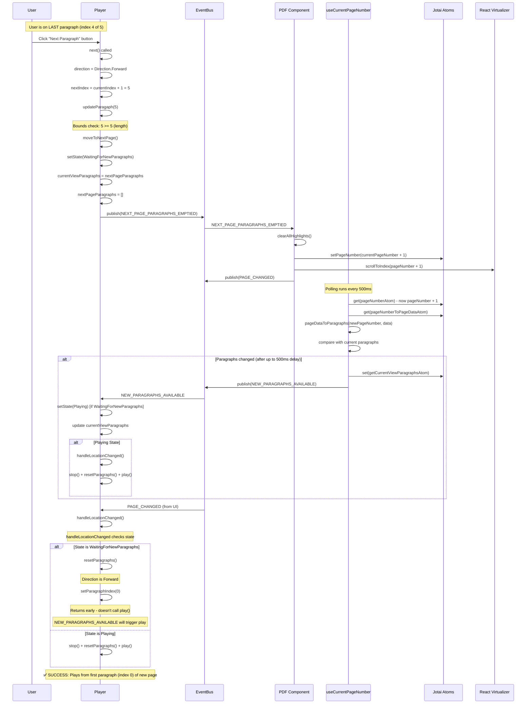
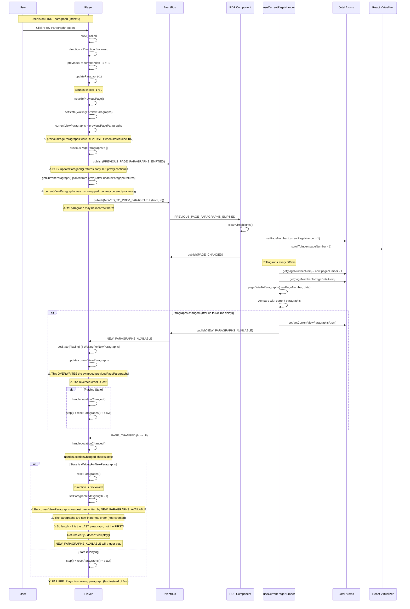

# Paragraph Navigation Flow Diagrams

## Flow 1: Next Paragraph (Last Paragraph → Next Page) - WORKING ✅

## Flow 2: Previous Paragraph (First Paragraph → Previous Page) - FAILING ❌

## Key Differences

### 1. Direction Setting
- **Next Flow**: `direction = Direction.Forward` → `resetParagraphs()` sets index to `0` ✅
- **Prev Flow**: `direction = Direction.Backward` → `resetParagraphs()` sets index to `length - 1` ❌

### 2. Paragraph Array Handling
- **Next Flow**: `nextPageParagraphs` are stored in normal order → swapped correctly ✅
- **Prev Flow**: `previousPageParagraphs` are **reversed** when stored (line 187) → but then **overwritten** by `NEW_PARAGRAPHS_AVAILABLE` which provides normal order ❌

### 3. Timing Issue
- **Next Flow**: When `NEW_PARAGRAPHS_AVAILABLE` arrives, `currentViewParagraphs` already has the swapped `nextPageParagraphs` in correct order ✅
- **Prev Flow**: When `NEW_PARAGRAPHS_AVAILABLE` arrives, it **overwrites** the swapped `previousPageParagraphs` (which were reversed), losing the reverse order ❌

### 4. Index Calculation
- **Next Flow**: `resetParagraphs()` with Forward direction → index = 0 (first paragraph of new page) ✅
- **Prev Flow**: `resetParagraphs()` with Backward direction → index = length - 1, but paragraphs are now in normal order, so this is the **last** paragraph, not the first ❌

## Root Cause

The issue is that `previousPageParagraphs` are reversed when stored (to account for backward navigation), but when `moveToPreviousPage()` swaps them into `currentViewParagraphs`, the subsequent `NEW_PARAGRAPHS_AVAILABLE` event **overwrites** them with paragraphs in normal order, losing the reverse order that was needed for correct backward navigation.

## Potential Fixes

1. **Don't reverse previousPageParagraphs**: Store them in normal order and adjust the index calculation in `resetParagraphs()` for backward direction
2. **Preserve reverse order**: When `NEW_PARAGRAPHS_AVAILABLE` arrives after `moveToPreviousPage()`, check if direction is Backward and reverse the paragraphs
3. **Different reset logic**: For backward direction, set index to 0 instead of length - 1, but reverse the paragraphs array first
4. **Delay NEW_PARAGRAPHS_AVAILABLE handling**: When in `WaitingForNewParagraphs` state after `moveToPreviousPage()`, don't overwrite `currentViewParagraphs` if direction is Backward

