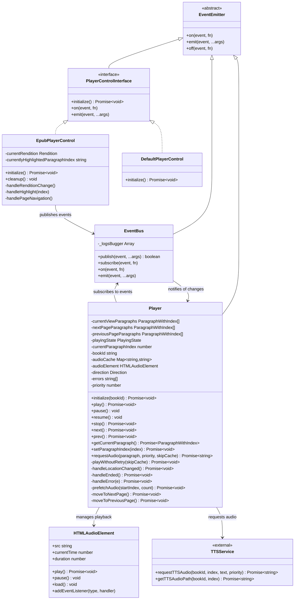
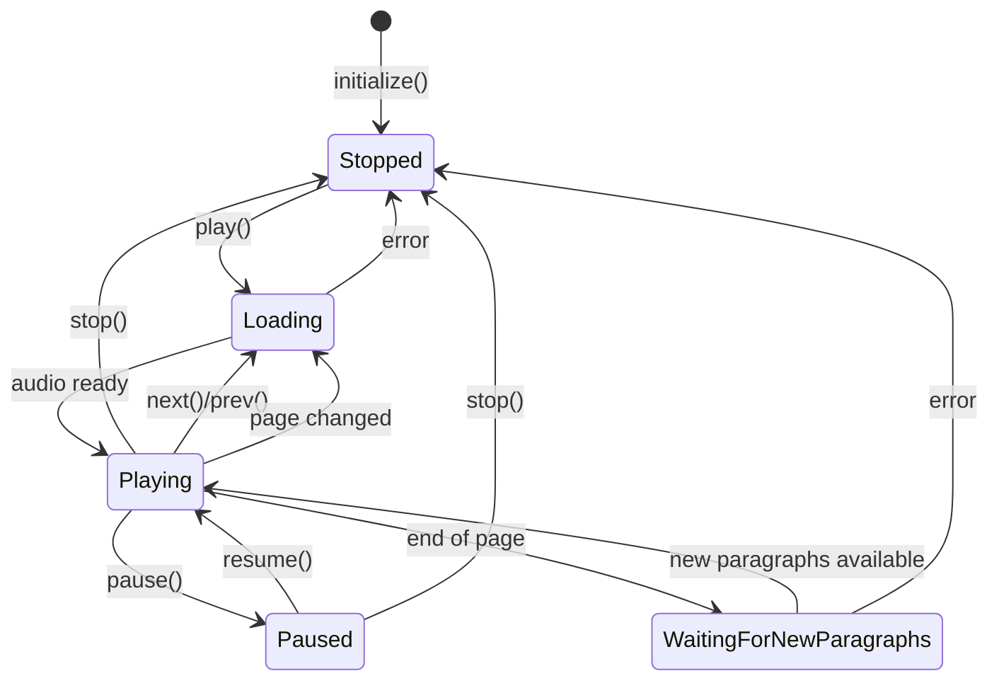
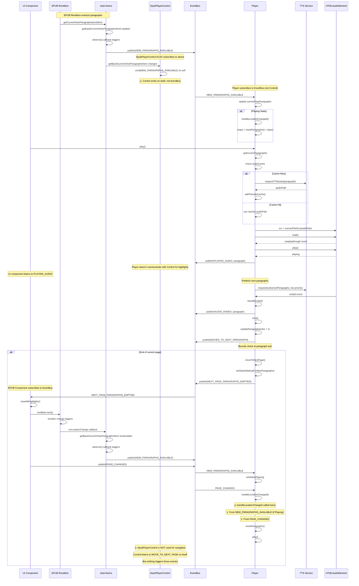
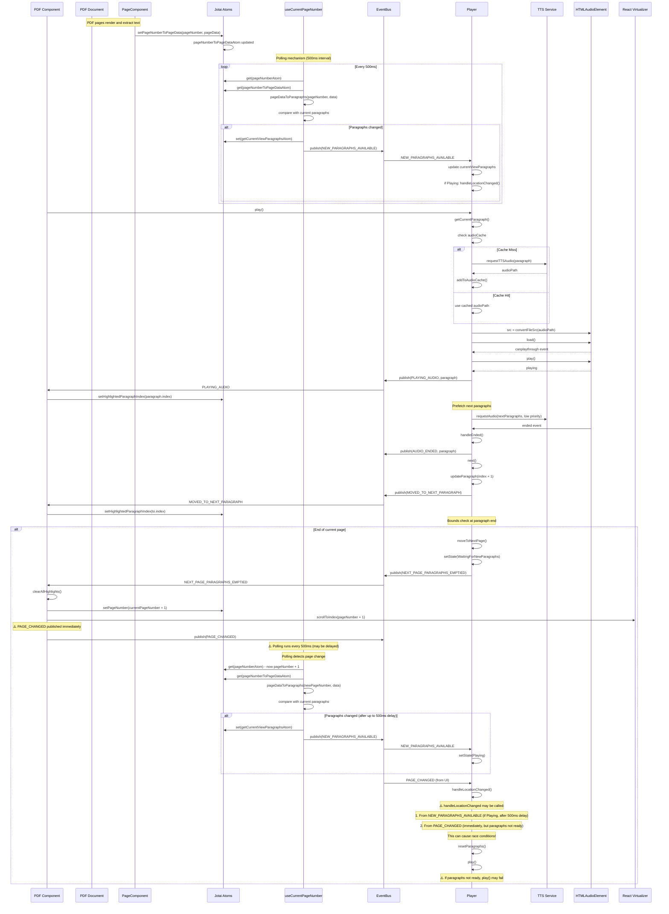
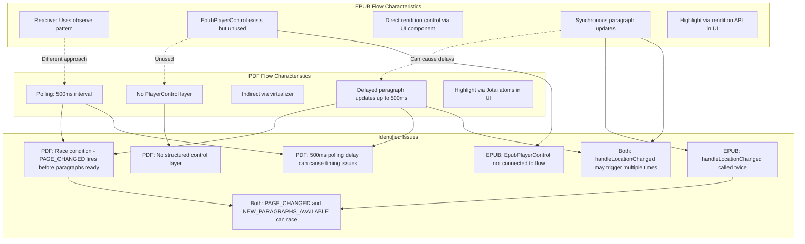
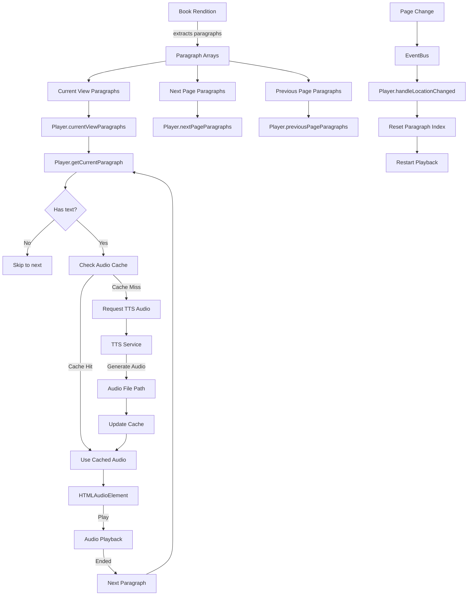
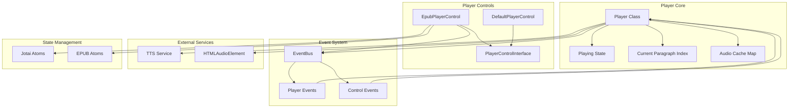

# Player Architecture Diagram

## State Flow Diagram

## Event Flow Diagrams

### EPUB Flow - Complete Sequence

### PDF Flow - Complete Sequence

### Key Differences and Identified Issues

#### Detailed Issue Analysis

**EPUB Issues:**

1. **Double handleLocationChanged**: Called from both `NEW_PARAGRAPHS_AVAILABLE` (if Playing) and `PAGE_CHANGED`
2. **Unused EpubPlayerControl**: Control layer exists but navigation happens directly in UI component via EventBus
3. **Race condition**: `PAGE_CHANGED` and `NEW_PARAGRAPHS_AVAILABLE` can arrive in different orders

**PDF Issues:**

1. **500ms polling delay**: Paragraphs may not be available when `PAGE_CHANGED` fires
2. **Race condition**: `PAGE_CHANGED` published immediately, but `NEW_PARAGRAPHS_AVAILABLE` delayed up to 500ms
3. **No control layer**: Direct EventBus communication without abstraction
4. **Timing dependency**: Player may try to play before paragraphs are ready

**Common Issues:**

1. **Multiple event triggers**: Both flows can trigger `handleLocationChanged` multiple times
2. **Event ordering**: No guarantee of event order between `PAGE_CHANGED` and `NEW_PARAGRAPHS_AVAILABLE`
3. **State synchronization**: Playing state may not align with paragraph availability

## Data Flow Diagram

## Component Relationships

